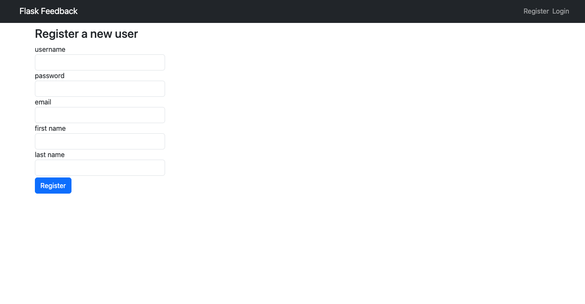

# Feedback App

This is a simple application that allows users to sign up, log in, and manage their feedback. Once logged in, users can create new feedback, edit their own feedback, delete their own feedback, and view a list of all feedback they have given. All routes requiring user authentication are protected to ensure that users can only manage their own feedback.

## Technologies Used

This application was built using the following technologies:
- Python
- SQLAlchemy

## Installation

To install and run this application, follow these steps:
1. Clone this repository to your local machine.
2. Navigate to the root directory of the cloned repository.
3. Run `npm install` to install the required dependencies.
4. Start the application by running `npm start`.
5. Open your web browser and go to `http://localhost:3000`.

## Usage

To use this application, follow these steps:
1. Create a new account by clicking the "Register" button and providing user details.
2. Log in to your account by clicking the "Log In" button and providing your username and password.
3. Once logged in, you will see the dashboard where you can view a list of all feedback you have given, as well as create new feedback, edit your own feedback, and delete your own feedback.

## Authentication

All routes requiring user authentication are protected to ensure that only authenticated users can access them. In addition, routes that require a user to manage their own feedback (such as editing or deleting their own feedback) are further protected to ensure that users can only manage their own feedback and not that of others.

## Database

This application uses POSTGRESQL to store user data and feedback. The user model has the following schema:
```
{
  username: {
    type: String,
    required: true,
    unique: true
  },
  password: {
    type: String,
    required: true
  }
  email: {
    type: String,
    required: true,
    unique: true
  }
  first_name: {
    type: String,
    required: true
  }
  last_name: {
    type: String,
    required: true
  }
}
```
The feedback model has the following schema:
```
{
  id: {
    type: Integer,
    required: true
  }
  title: {
    type: String,
    required: true
  },
  content: {
    type: String,
    required: true
  },
  username: {
    foreignkey: users.username,
    required: true
  }
}
```
The `username` field in the feedback model is a reference to the `User` model, and is used to associate feedback with the user who created it.

## Routes

This application has the following routes:
- `/` - displays the home page
- `/register` - displays the sign up form
- `/register` (POST) - handles the sign up form submission
- `/login` - displays the login form
- `/login` (POST) - handles the login form submission
- `/users/<username>` - displays the dashboard, which shows a list of all feedback the user has given
- `/users/<username>/feedback/add` - displays the form for creating new feedback
- `/users/<username>/feedback/add` (POST) - handles the new feedback form submission
- `/feedback/<feedback_id>/update` - displays the form for editing feedback with the specified `id`
- `/feedback/<feedback_id>/update` (POST) - handles the feedback edit form submission
- `/feedback/<feedback_id>/delete` - handles the deletion of feedback with the specified `id`



## License

This application is not licensed
